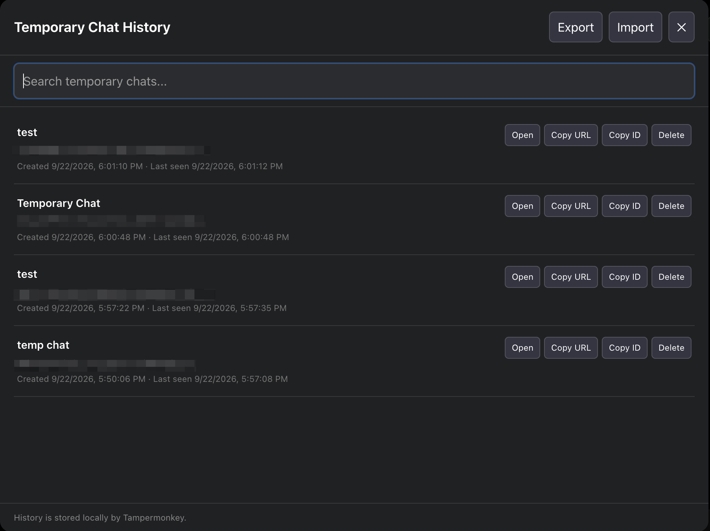

<a id="top"></a>

# ChatGPT Temporary Chat History

<a href="./LICENSE"></a>
<a href="https://github.com/digvijayad/ChatGPT-temporary-chat-history/releases/latest"></a>

A Tampermonkey userscript that keeps a **local recovery history for ChatGPT Temporary Chats**.

Temporary Chats are intentionally absent from ChatGPT's normal sidebar history. This userscript records their conversation IDs and URLs in Tampermonkey's local storage so you can reopen a temporary conversation while it is still available to your account or session.

> This project is independent and is not affiliated with or endorsed by OpenAI.

## Install

### One-click install

<a href="https://raw.githubusercontent.com/digvijayad/ChatGPT-temporary-chat-history/main/chatgpt-temporary-chat-history.user.js"></a><a href="#installation"></a>
<br>
[Latest release](https://github.com/digvijayad/ChatGPT-temporary-chat-history/releases/latest) /
[Get support](https://github.com/digvijayad/ChatGPT-temporary-chat-history/issues) /
[View changelog](./CHANGELOG.md) /
[Contact author](https://github.com/digvijayad)

> Requires the Tampermonkey browser extension.

## Preview

### Temporary Chat history



Search saved chats, reopen them, copy their URL or ID, delete individual entries, and import or export the complete history.

### Header button


The clock button stays beside ChatGPT's native header controls. Its badge shows the number of locally saved Temporary Chats.

## Features

- Automatically detects Temporary Chats and saves their conversation IDs and canonical URLs.
- Uses the first user prompt as a readable title when available.
- Keeps up to 500 entries in Tampermonkey's local storage.
- Adds a compact history button beside ChatGPT's current header controls.
- Repositions automatically as the ChatGPT header changes.
- Searches saved titles, conversation IDs, and URLs.
- Opens saved conversations and copies their URL or ID.
- Deletes individual entries and imports or exports history as JSON.
- Sends no saved history to an external service.

## Usage

1. Start a Temporary Chat on ChatGPT and send a message.
2. The script detects the conversation and saves its ID, URL, and first-prompt title locally.
3. Select the clock button in the ChatGPT header to open Temporary Chat History.
4. Search the list or use **Open**, **Copy URL**, **Copy ID**, and **Delete** for an entry.
5. Use **Export** to create a backup and **Import** to restore one.

## Installation

### One-click

1. Install [Tampermonkey](https://www.tampermonkey.net/) for your browser.
2. Select the **Install this script** button above, or open the [raw userscript](https://raw.githubusercontent.com/digvijayad/ChatGPT-temporary-chat-history/main/chatgpt-temporary-chat-history.user.js).
3. Confirm the installation when Tampermonkey opens.
4. Open or refresh [ChatGPT](https://chatgpt.com/).

### Manual fallback

1. Open Tampermonkey and choose **Create a new script**.
2. Replace the starter template with the contents of `chatgpt-temporary-chat-history.user.js`.
3. Save and enable the script, then refresh ChatGPT.

### Automatic updates

The userscript includes:

- `@downloadURL` for downloading the latest copy from GitHub.
- `@updateURL` for lightweight version checks through `chatgpt-temporary-chat-history.meta.js`.

Tampermonkey periodically compares the published `@version` with the installed version and updates according to the user's Tampermonkey settings.

## Privacy

Saved entries remain in Tampermonkey's local storage. The script does not send saved history to an external service.

Exporting history creates a local JSON download. Treat exported files as potentially sensitive because they may contain conversation IDs, URLs, and first-prompt text.

## Limitations

- A locally saved URL does not guarantee that a Temporary Chat will remain accessible indefinitely.
- ChatGPT interface changes can require selector or positioning updates.
- The script is designed for Temporary Chats and does not replace ChatGPT's normal conversation history.
- Browser extensions, custom stylesheets, experimental layouts, and narrow viewports may affect header placement.

## How It Works

The userscript observes ChatGPT navigation state, URLs, Temporary Chat indicators, relevant browser activity, and the first user message. It stores detected entries with Tampermonkey's `GM_getValue` and `GM_setValue` APIs.

The history button is not inserted into ChatGPT's React component hierarchy. Instead, the script locates the active native header controls, positions the button beside them, and updates that position as the interface changes.

## Development

Requirements:

- Node.js 20 or newer is recommended.
- npm.

Install dependencies and validate:

```bash
npm install
npm run check
```

Other commands:

```bash
npm run format
npm run format:check
npm run lint
node --check chatgpt-temporary-chat-history.user.js
```

## Publishing

The main `.user.js` file can be published directly to a userscript host such as Greasy Fork or OpenUserJS. Increment `@version` for every release and keep the userscript, metadata file, package version, and changelog synchronized.

See [PUBLISHING.md](./PUBLISHING.md) for the release checklist.

## Repository Structure

```text
.
├── assets/
│   └── images/
│       ├── buttons/
│       │   ├── help.svg
│       │   └── install-this-script.svg
│       └── screenshots/
│           ├── history-button.png
│           └── history-modal.png
├── chatgpt-temporary-chat-history.user.js
├── chatgpt-temporary-chat-history.meta.js
├── README.md
├── CHANGELOG.md
├── CONTRIBUTING.md
├── PUBLISHING.md
├── SECURITY.md
├── LICENSE
├── package.json
└── eslint.config.js
```

## Reporting Bugs

[Open an issue](https://github.com/digvijad/ChatGPT-temporary-chat-history/issues/new) with:

- Your browser and Tampermonkey versions.
- The script version.
- The ChatGPT page state where the problem occurred.
- Console errors beginning with `[Temp History]`.
- A screenshot when the problem is visual.

Do not post private conversation URLs, conversation IDs, account details, or sensitive chat content in a public issue.

## License

MIT. See [LICENSE](./LICENSE).
